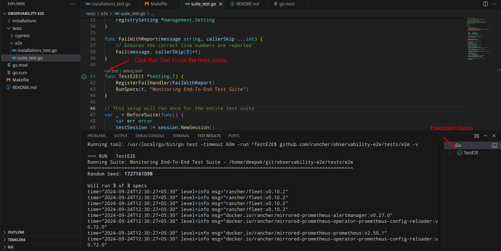

# Observability E2E Tests

This repository contains end-to-end (E2E) tests for monitoring installations in Rancher. Follow the steps below to set up and run the tests.

## Prerequisites

Before you start, ensure the following prerequisites are met:

- Go is installed on `1.22.0`.
- Rancher is installed and configured.
- Ensure you have cloned this repository.

## Configuration

Before running the tests, ensure the `cattle-config.yaml` file is correctly configured. This file contains essential parameters for running the tests.

### Example `cattle-config.yaml`

```yaml
rancher:
  host: <Rancher URL>
  adminToken: <Your Admin Token>
  insecure: True
  clusterName: local
  cleanup: false
```

Make sure to replace the placeholder values (`<Rancher URL>`, `<Your Admin Token>`) with the actual values.

## Running Tests

### 1. Via Command Line

Go to the `observability-e2e` directory and run the following command:
```bash
go test -timeout 60m -run ^TestE2E$ github.com/rancher/observability-e2e/tests/e2e -v
```

Run individual or group of tests with labels using CLI
```
TEST_LABEL_FILTER=monitoring  /usr/local/go/bin/go test -timeout 60m github.com/rancher/observability-e2e/tests/e2e -v -count=1 -ginkgo.v
```

This command will:
- Run the E2E test suite located in the `tests/e2e/` directory.
- Display detailed output about the test progress and results.

### Example Test Output:

```bash
> TEST_LABEL_FILTER=LEVEL0  /usr/local/go/bin/go test -timeout 60m github.com/rancher/observability-e2e/tests/e2e -v -ginkgo.v

=== RUN   TestE2E
I1010 18:54:10.835821 19344 suite_test.go:56] Executing tests with label 'LEVEL0'
Running Suite: Observability End-To-End Test Suite - git/observability-e2e/tests/e2e
=================================================================================================
Random Seed: 1728566650

Will run 3 of 3 specs
------------------------------
[BeforeSuite]
git/observability-e2e/tests/e2e/suite_test.go:61
[BeforeSuite] PASSED [3.650 seconds]
------------------------------
Observability Installation Test Suite Install monitoring chart [LEVEL0, monitoring, Author:dpunia]
git/observability-e2e/tests/e2e/installations_test.go:40
STEP: Creating a client session @ 10/10/24 18:54:14.486
STEP: 1) Checking if the monitoring chart is already installed @ 10/10/24 18:54:18.266
I1010 18:54:21.919948 19344 installations_test.go:66] Retrieved latest monitoring chart version to install: 103.2.0-rc.1+up57.0.3
STEP: 2) Installing monitoring chart with the latest version @ 10/10/24 18:54:21.919
STEP: 3) Waiting for monitoring chart deployments to have expected replicas @ 10/10/24 18:55:49.578
STEP: 4) Waiting for monitoring chart DaemonSets to have expected nodes @ 10/10/24 18:55:53.645
STEP: 5) Waiting for monitoring chart StatefulSets to have expected replicas @ 10/10/24 18:55:57.693
• [107.282 seconds]
------------------------------
Observability Installation Test Suite Install Alerting chart [LEVEL0, alerting, Author:dpunia]
/git/observability-e2e/tests/e2e/installations_test.go:88
STEP: Creating a client session @ 10/10/24 18:56:01.768
I1010 18:56:09.840609 19344 installations_test.go:96] Retrieved latest alerting chart version to install: 103.0.2
STEP: Installing alerting chart with the latest version @ 10/10/24 18:56:09.84
STEP: Waiting for alerting chart deployments to have expected replicas @ 10/10/24 18:56:31.397
STEP: Waiting for alerting chart DaemonSets to have expected nodes @ 10/10/24 18:56:35.489
STEP: Waiting for alerting chart StatefulSets to have expected replicas @ 10/10/24 18:56:39.533
• [41.790 seconds]
------------------------------
Observability Installation Test Suite Install Logging chart [LEVEL0, logging, Author:dpunia]
git/observability-e2e/tests/e2e/installations_test.go:129
STEP: Creating a client session @ 10/10/24 18:56:43.558
I1010 18:56:51.621088 19344 installations_test.go:137] Retrieved latest logging chart version to install: 103.1.3-rc.1+up4.8.0
STEP: Installing logging chart with the latest version @ 10/10/24 18:56:51.621
STEP: Waiting for logging chart deployments to have expected replicas @ 10/10/24 18:57:13.149
STEP: Waiting for logging chart DaemonSets to have expected nodes @ 10/10/24 18:57:17.604
STEP: Waiting for logging chart StatefulSets to have expected replicas @ 10/10/24 18:57:22.082
• [43.069 seconds]
------------------------------
[AfterSuite]
git/observability-e2e/tests/e2e/suite_test.go:91
[AfterSuite] PASSED [0.000 seconds]
------------------------------

Ran 3 of 3 Specs in 195.792 seconds
SUCCESS!</strong> -- SUCCESS! -- 3 Passed | 0 Failed | 0 Pending | 0 Skipped
--- PASS: TestE2E (195.79s)
PASS
ok      github.com/rancher/observability-e2e/tests/e2e  195.813s
```

### 2. Via VS Code

If you're using **VS Code**, you can also run the tests directly within the editor:

1. Open the `suite_test.go` file located at `tests/e2e/suite_test.go`.
2. Click on **"Run Test"** next to the `TestE2E` function (as indicated in the attached screenshot).
3. Monitor the test execution status in the **Test** panel within VS Code.

Below is the ScreenShot Attched:


